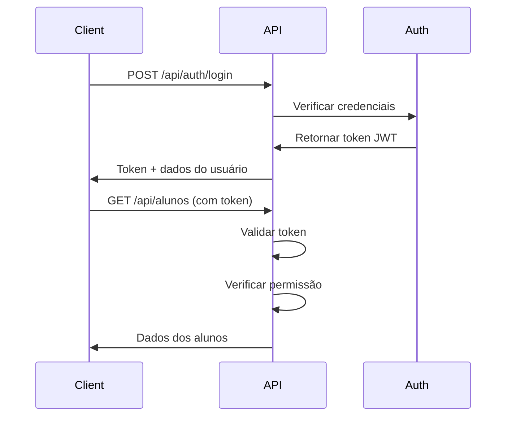

# API REST - Gerenciador de Academia

## 📋 Índice

- [Sobre o Projeto](#sobre-o-projeto)
- [Tecnologias Utilizadas](#tecnologias-utilizadas)
- [Arquitetura](#arquitetura)
- [Estrutura de Diretórios](#estrutura-de-diretórios)
- [Instalação](#instalação)
- [Execução](#execução)
- [Endpoints](#endpoints)
- [Testes](#testes)
- [Documentação Swagger](#documentação-swagger)
- [Validações](#validações)

## 🎯 Sobre o Projeto

API REST desenvolvida para gerenciamento de uma academia, permitindo cadastro de alunos, funcionários, planos, registro de checkins e autenticação de funcionários. A API segue boas práticas de desenvolvimento, Clean Code e possui cobertura de testes com MOCK.

## 🛠 Tecnologias Utilizadas

### Core
- **Node.js** - Runtime JavaScript
- **Express.js** - Framework web para Node.js
- **bcrypt** - Hash de senhas
- **jsonwebtoken (JWT)** - Autenticação baseada em tokens

### Validação e Segurança
- **express-validator** - Validação de dados de entrada
- **CORS** - Cross-Origin Resource Sharing

### Documentação
- **Swagger** - Documentação automática da API

### Testes
- **Jest** - Framework de testes
- **Supertest** - Testes de integração HTTP

### Desenvolvimento
- **Nodemon** - Auto-reload durante desenvolvimento
- **dotenv** - Gerenciamento de variáveis de ambiente

## 🏗 Arquitetura

A API segue uma arquitetura em camadas (Layered Architecture) separando as responsabilidades:

```
┌─────────────────────────────────────┐
│         Routes (Rotas)              │
│    - Define endpoints da API        │
└──────────────┬──────────────────────┘
               │
┌──────────────▼──────────────────────┐
│      Controllers (Controladores)    │
│    - Lógica de negócio              │
└──────────────┬──────────────────────┘
               │
┌──────────────▼──────────────────────┐
│        Services (Serviços)          │
│    - Acesso aos dados               │
└──────────────┬──────────────────────┘
               │
┌──────────────▼──────────────────────┐
│         Models (Modelos)            │
│    - Estrutura dos dados            │
└─────────────────────────────────────┘
```

### Fluxo de Requisição

1. **Routes**: Recebe a requisição HTTP e delega para o controller
2. **Validators**: Valida os dados de entrada antes de processar
3. **Controller**: Processa a lógica de negócio
4. **Service**: Gerencia o acesso aos dados (armazenamento)
5. **Model**: Define a estrutura dos dados

## 📁 Estrutura de Diretórios

```
api_rest/
├── src/
│   ├── app.js                      # Configuração do servidor Express
│   ├── models/
│   │   ├── Aluno.js                # Modelo de Aluno
│   │   ├── Funcionario.js          # Modelo de Funcionário
│   │   ├── Plano.js                # Modelo de Plano
│   │   ├── Checkin.js              # Modelo de Checkin
│   │   └── Permissions.js          # Definição de permissões e perfis
│   ├── middlewares/
│   │   └── authMiddleware.js       # Middleware de autenticação JWT
│   ├── services/
│   │   └── StorageService.js       # Serviço de armazenamento (Mock)
│   ├── controllers/
│   │   ├── alunoController.js      # Controller de Alunos
│   │   ├── funcionarioController.js # Controller de Funcionários
│   │   ├── planoController.js      # Controller de Planos
│   │   ├── checkinController.js    # Controller de Checkins
│   │   └── authController.js       # Controller de Autenticação
│   ├── validators/
│   │   ├── alunoValidators.js      # Validadores de Aluno
│   │   ├── funcionarioValidators.js # Validadores de Funcionário
│   │   ├── planoValidators.js      # Validadores de Plano
│   │   └── checkinValidators.js    # Validadores de Checkin
│   └── routes/
│       ├── alunoRoutes.js          # Rotas de Alunos
│       ├── funcionarioRoutes.js    # Rotas de Funcionários
│       ├── planoRoutes.js          # Rotas de Planos
│       ├── checkinRoutes.js        # Rotas de Checkins
│       └── authRoutes.js           # Rotas de Autenticação
├── rest/
│   └── test/
│       ├── data/                   # Dados de teste (JSON)
│       ├── aluno.test.js           # Testes de Aluno
│       ├── funcionario.test.js     # Testes de Funcionário
│       └── auth.test.js            # Testes de Autenticação
├── jest.config.js                  # Configuração do Jest
├── jest.setup.js                   # Configuração do ambiente de teste
├── package.json                    # Dependências do projeto
└── README.md                       # Este arquivo
```

## 🚀 Instalação

### Pré-requisitos

- Node.js (versão 14 ou superior)
- npm (geralmente vem com o Node.js)

### Passos

1. Clone o repositório e navegue até a pasta:
```bash
cd api_rest
```

2. Instale as dependências:
```bash
npm install
```

## ▶️ Execução

### Modo Desenvolvimento
```bash
npm run dev
```
O servidor iniciará em: `http://localhost:3000`

### Modo Produção
```bash
npm start
```

## 📡 Endpoints

### Alunos

#### POST /api/alunos
Cadastra um novo aluno.

**Body:**
```json
{
  "nomeCompleto": "Carlos Andrade Silva",
  "email": "carlos.silva@email.com",
  "telefone": "11987654321",
  "dataNascimento": "1995-07-20",
  "cpf": "12345678900",
  "planoId": "MUSCULAÇÃO",
  "dataInicio": "2025-10-26",
  "endereco": {
    "rua": "Rua das Flores",
    "numero": "123",
    "complemento": "Apto 10",
    "bairro": "Centro",
    "cidade": "São Paulo",
    "estado": "SP",
    "cep": "01000-000"
  },
  "informacoesMedicas": "Nenhuma restrição conhecida."
}
```

**Resposta (201):**
```json
{
  "message": "Aluno cadastrado com sucesso",
  "id": "123456789",
  "nomeCompleto": "Carlos Andrade Silva"
}
```

#### GET /api/alunos
Lista todos os alunos cadastrados.

#### GET /api/alunos/:id
Busca um aluno específico por ID.

#### PUT /api/alunos/:id
Atualiza um aluno existente.

**Body (campos opcionais):**
```json
{
  "nomeCompleto": "Carlos Silva Atualizado",
  "telefone": "11987654321",
  "planoId": "PLANO_PREMIUM"
}
```

**Resposta (200):**
```json
{
  "message": "Aluno atualizado com sucesso",
  "aluno": {
    "id": "123456789",
    "nomeCompleto": "Carlos Silva Atualizado",
    "email": "carlos.silva@email.com"
  }
}
```

#### DELETE /api/alunos/:id
Deleta um aluno.

**Resposta (200):**
```json
{
  "message": "Aluno deletado com sucesso"
}
```

---

### Funcionários

#### POST /api/funcionarios
Cadastra um novo funcionário.

**Body:**
```json
{
  "nomeCompleto": "Beatriz Martins",
  "email": "beatriz.martins@academia.com",
  "userName": "beatriz_martins",
  "senha": "Senha@Forte123",
  "telefone": "11912345678",
  "dataNascimento": "1990-02-15",
  "cpf": "98765432100",
  "cargo": "Instrutor",
  "perfil": "INSTRUTOR",
  "dataAdmissao": "2025-01-10",
  "cref": "123456-G/SP",
  "salario": 3500.50
}
```

> **Nota**: O campo `perfil` é opcional. Se não informado, o perfil padrão será `RECEPCIONISTA`. Valores aceitos: `ADMINISTRADOR`, `GERENTE`, `INSTRUTOR`, `RECEPCIONISTA`.

**Resposta (201):**
```json
{
  "message": "Funcionário cadastrado com sucesso",
  "id": "123456789",
  "nomeCompleto": "Beatriz Martins",
  "userName": "beatriz_martins"
}
```

#### GET /api/funcionarios
Lista todos os funcionários cadastrados.

#### GET /api/funcionarios/:id
Busca um funcionário específico por ID.

#### PUT /api/funcionarios/:id
Atualiza um funcionário existente.

**Body (campos opcionais):**
```json
{
  "nomeCompleto": "Beatriz Martins Atualizado",
  "telefone": "11912345678",
  "cargo": "Coordenador",
  "perfil": "GERENTE",
  "salario": 4500.00
}
```

**Resposta (200):**
```json
{
  "message": "Funcionário atualizado com sucesso",
  "funcionario": {
    "id": "123456789",
    "nomeCompleto": "Beatriz Martins Atualizado",
    "userName": "beatriz_martins",
    "perfil": "GERENTE"
  }
}
```

#### DELETE /api/funcionarios/:id
Deleta um funcionário.

**Resposta (200):**
```json
{
  "message": "Funcionário deletado com sucesso"
}
```

---

### Planos

#### POST /api/planos
Cadastra um novo plano.

**Body:**
```json
{
  "nome": "PLANO_PREMIUM",
  "descricao": "Acesso completo à academia e aulas",
  "valor": 150.00,
  "duracao": 30,
  "beneficios": ["Acesso ilimitado", "Aulas coletivas", "Avaliação física mensal"]
}
```

**Resposta (201):**
```json
{
  "message": "Plano cadastrado com sucesso",
  "id": "PLANO_PREMIUM",
  "nome": "PLANO_PREMIUM"
}
```

#### GET /api/planos
Lista todos os planos cadastrados.

#### GET /api/planos/:id
Busca um plano específico por ID.

#### PUT /api/planos/:id
Atualiza um plano existente.

**Body (campos opcionais):**
```json
{
  "descricao": "Acesso completo à academia e todas as aulas",
  "valor": 180.00,
  "beneficios": ["Acesso ilimitado", "Aulas coletivas", "Avaliação física mensal", "Nutricionista"]
}
```

**Resposta (200):**
```json
{
  "message": "Plano atualizado com sucesso",
  "plano": {
    "id": "PLANO_PREMIUM",
    "nome": "PLANO_PREMIUM",
    "valor": 180.00
  }
}
```

#### DELETE /api/planos/:id
Deleta um plano.

**Resposta (200):**
```json
{
  "message": "Plano deletado com sucesso"
}
```

---

### Checkins

#### POST /api/checkins
Registra um novo checkin.

**Body:**
```json
{
  "alunoId": "123456789",
  "observacao": "Treino de pernas"
}
```

**Resposta (201):**
```json
{
  "message": "Checkin registrado com sucesso",
  "id": "987654321",
  "alunoId": "123456789",
  "dataHora": "2023-10-26T14:30:00Z"
}
```

#### GET /api/checkins
Lista todos os checkins cadastrados.

#### GET /api/checkins/:id
Busca um checkin específico por ID.

#### GET /api/checkins/aluno/:alunoId
Lista todos os checkins de um aluno específico.

**Resposta (200):**
```json
{
  "checkins": [
    {
      "id": "987654321",
      "alunoId": "123456789",
      "dataHora": "2023-10-26T14:30:00Z",
      "observacao": "Treino de pernas"
    },
    {
      "id": "987654322",
      "alunoId": "123456789",
      "dataHora": "2023-10-27T16:45:00Z",
      "observacao": "Treino de braços"
    }
  ]
}
```

#### DELETE /api/checkins/:id
Deleta um checkin.

**Resposta (200):**
```json
{
  "message": "Checkin deletado com sucesso"
}
```

---

### Autenticação

#### POST /api/auth/login
Realiza login de funcionário.

**Body:**
```json
{
  "userName": "beatriz_martins",
  "senha": "Senha@Forte123"
}
```

**Resposta (200):**
```json
{
  "message": "Login realizado com sucesso",
  "token": "eyJhbGciOiJIUzI1NiIsInR5cCI6IkpXVCJ9...",
  "funcionario": {
    "id": "123456789",
    "nomeCompleto": "Beatriz Martins",
    "userName": "beatriz_martins",
    "email": "beatriz.martins@academia.com",
    "cargo": "Instrutor",
    "perfil": "INSTRUTOR"
  }
}
```

> **Importante**: Use o `token` retornado no header `Authorization: Bearer <token>` para acessar os endpoints protegidos.

**Resposta (401) - Credenciais Inválidas:**
```json
{
  "message": "Credenciais inválidas",
  "tentativasRestantes": 2
}
```

**Resposta (403) - Conta Bloqueada:**
```json
{
  "message": "Conta bloqueada. Você excedeu o número máximo de tentativas"
}
```

## 🧪 Testes

### Executar Todos os Testes
```bash
npm test
```

### Executar Testes com Cobertura
```bash
npm run test:coverage
```

### Cobertura de Testes

O projeto possui **testes** cobrindo todas as funcionalidades da API:
- Testes de cadastro, listagem, busca, atualização e exclusão de alunos
- Testes de cadastro, listagem, busca, atualização e exclusão de funcionários
- Testes de autenticação com bloqueio após 3 tentativas
- Testes de validação de permissões por perfil

**Tipos de Teste:**
- **Teste de Sentença**: Valida que cada linha de código é executada
- **Teste de Decisão**: Valida que todos os caminhos lógicos são testados (if/else, loops, etc.)

Os testes estão isolados usando **MOCK**, garantindo que cada teste seja independente e possa ser executado isoladamente.

## 🔐 Autenticação e Autorização

A API utiliza autenticação baseada em tokens JWT (JSON Web Tokens).

### Como Autenticar

1. **Realize o login** através do endpoint `POST /api/auth/login`
2. **Copie o token** retornado na resposta
3. **Inclua o token** em todas as requisições no header:
   ```
   Authorization: Bearer <token>
   ```

### Perfis de Usuário

A API possui 4 perfis de usuário com permissões diferentes:

#### 1. ADMINISTRADOR
Acesso completo a todas as funcionalidades.
- ✅ Listar, criar, visualizar, editar e excluir alunos
- ✅ Listar, criar, visualizar, editar e excluir funcionários
- ✅ Gerar relatórios
- ✅ Visualizar dados financeiros

#### 2. GERENTE
Acesso a operações administrativas e relatórios.
- ✅ Listar, criar, visualizar e editar alunos
- ✅ Listar e visualizar funcionários
- ✅ Gerar relatórios
- ✅ Visualizar dados financeiros
- ❌ Excluir alunos
- ❌ Gerenciar funcionários (criar, editar, excluir)

#### 3. INSTRUTOR
Acesso limitado para consulta e edição de alunos.
- ✅ Listar e visualizar alunos
- ✅ Editar alunos
- ❌ Criar ou excluir alunos
- ❌ Gerenciar funcionários
- ❌ Gerar relatórios
- ❌ Visualizar dados financeiros

#### 4. RECEPCIONISTA
Acesso para operações básicas com alunos.
- ✅ Listar, criar, visualizar e editar alunos
- ❌ Excluir alunos
- ❌ Gerenciar funcionários
- ❌ Gerar relatórios
- ❌ Visualizar dados financeiros

### Fluxo de Autenticação



## 📚 Documentação Swagger

Após iniciar o servidor, acesse:

```
http://localhost:3000/api-docs
```

A documentação interativa permite testar todos os endpoints diretamente pelo navegador. Use o botão "Authorize" (ícone de cadeado) para inserir seu token JWT e testar endpoints protegidos.

## ✅ Validações

### Aluno

| Campo | Tipo | Obrigatório | Validação |
|-------|------|-------------|-----------|
| nomeCompleto | string | Sim | Até 250 caracteres alfanuméricos |
| email | string | Sim | Até 150 caracteres, formato de email |
| telefone | string | Sim | Até 11 dígitos numéricos |
| dataNascimento | string | Sim | Formato "AAAA-MM-DD" |
| cpf | string | Não | Até 11 dígitos numéricos |
| planoId | string | Não | Default: "MUSCULAÇÃO" |
| dataInicio | string | Não | Formato "AAAA-MM-DD", default: data atual |
| endereco.rua | string | Sim | Até 250 caracteres |
| endereco.numero | string | Sim | Até 10 caracteres |
| endereco.complemento | string | Não | Até 250 caracteres |
| endereco.bairro | string | Não | Até 100 caracteres |
| endereco.cidade | string | Sim | Até 80 caracteres |
| endereco.estado | string | Sim | 2 caracteres (sigla do estado) |
| endereco.cep | string | Sim | Formato "00000-000" |
| informacoesMedicas | string | Não | Texto livre |

### Funcionário

| Campo | Tipo | Obrigatório | Validação |
|-------|------|-------------|-----------|
| nomeCompleto | string | Sim | Até 250 caracteres alfanuméricos |
| email | string | Sim | Até 150 caracteres, formato de email, único |
| userName | string | Sim | Até 100 caracteres alfanuméricos, único |
| senha | string | Sim | Mínimo 6, máximo 20 caracteres |
| telefone | string | Sim | Até 11 dígitos numéricos |
| dataNascimento | string | Sim | Formato "AAAA-MM-DD" |
| cpf | string | Não | Até 11 dígitos numéricos |
| cargo | string | Sim | Até 100 caracteres |
| perfil | string | Não | ADMINISTRADOR, GERENTE, INSTRUTOR ou RECEPCIONISTA (padrão: RECEPCIONISTA) |
| dataAdmissao | string | Não | Formato "AAAA-MM-DD", default: data atual |
| cref | string | Não | Texto livre |
| salario | number | Sim | Float com até 10 caracteres |

### Login

| Campo | Tipo | Obrigatório | Validação |
|-------|------|-------------|-----------|
| userName | string | Sim | - |
| senha | string | Sim | - |

**Segurança:**
- Máximo de 3 tentativas de login inválidas
- Conta bloqueada após exceder tentativas
- Senha armazenada com hash (bcrypt)

**Autenticação:**
- Token JWT retornado no login
- Token válido por 24 horas
- Incluir token no header `Authorization: Bearer <token>` em todas as requisições protegidas

## 📝 Status Codes

- **200** - Sucesso
- **201** - Criado com sucesso
- **400** - Erro de validação
- **401** - Não autorizado (token inválido ou ausente)
- **403** - Proibido (sem permissão ou conta bloqueada)
- **404** - Não encontrado
- **409** - Conflito (dados duplicados)
- **500** - Erro interno do servidor

### Exemplos de Respostas

**401 - Não Autorizado**
```json
{
  "message": "Token não fornecido"
}
```

**403 - Sem Permissão**
```json
{
  "message": "Acesso negado. Você não tem permissão para realizar esta ação",
  "permissaoRequerida": "CRIAR_ALUNO",
  "seuPerfil": "INSTRUTOR"
}
```

## 🔒 Segurança

- **Autenticação JWT**: Tokens com expiração de 24 horas
- **Autorização baseada em perfis**: Controle de acesso granular
- **Senhas hashadas com bcrypt**: Hash de senha antes de armazenar
- **Validação de dados de entrada**: Todos os campos são validados
- **Controle de tentativas de login**: Bloqueio após 3 tentativas inválidas
- **CORS configurado**: Controle de origem cruzada
- **Dados sensíveis não retornados**: Senhas e informações confidenciais ocultas
- **Middleware de autenticação**: Verificação automática em todas as rotas protegidas

## 🤝 Contribuindo

Este é um projeto didático. Sinta-se à vontade para aprender com o código e adaptar conforme necessário.